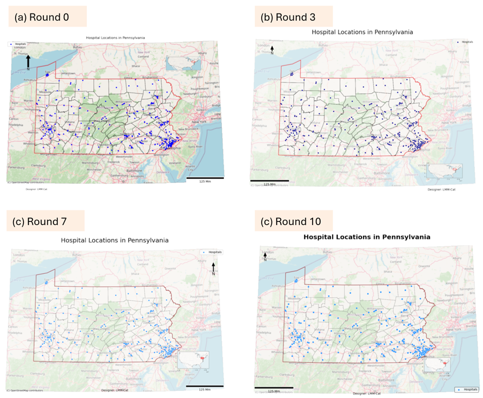

# LLM-Cat: An autonomous cartography agent
We prototyped a cartography agent named LLM-Cat to make simple maps. It utilized the vision modal of GPT-4o to demonstrate the possibility of vision-based autonomous cartography. LLM-Cat accepted map-making requests in natural language and generated maps using Python code. Since cartography is a vision-based and iterative process, it requires map cognition and the causation between the code (or GIS operations) and the map. Trained cartographers usually make multiple attempts and modifications before the map fits the context and requirements. We argue that AGI with the vision modal can make maps by mimicking the cartographers’ behaviors; therefore, LLM-Cat is designed to work in an iterative way:
1) it generates an initial map based on the given data and requirements; 
2) it reviews the map and points out one issue (e.g., the legend is missing); 
3) it revises the code to solve the issue and generates a new map; 
3) LLM-Cat repeats step 2) and 3) until research the maximum iteration it thinks there are no issues. 

# Installation

Clone or download the repository, rename `your_config.ini` as `config.ini`. Then, put your OpenAI API key in the `config.ini` file. Please use GPT-4, the lower versions such as 3.5 do no have enough reasoning ability to generate correct solution graph and operation code.

If you have difficulties installing `GeoPandas` in Windows, refer to this [post](https://geoffboeing.com/2014/09/using-geopandas-windows/). 


# How to use
Start `LLM_Cat` Jupyter notebook, and input your requests and data location in the cell. Run all cells and you will get the results.
 
# Case studies
Here we show the input of a use case of LLM-Cat; it requires the agent to create a map showing the hospital locations in Pennsylvania, USA. The map requirements are detailed in natural language, such as title, north arrow, and basemap. Data locations are also provided. Figure 8  shows the maps generated from 4 rounds (Round 0, 3, 7, and 10). After 10 rounds, LLM-Cat achieved several improvements, including title fonts,  “Designer” location, north arrow height, hospital point color, and basemap transparency. These improvements make the map look better than Round 0 (initial map). We noticed that the backed AGI (GPT-4o) has relatively weak map aesthetics and cartography skills, so the final map does not look very appealing but it does meet all the requirements. This is one of the first attempts among others to use AGI for autonomous cartography, and the result is promising. 

```angular2html
TASK = “1. Create a map showing the hospital locations in Pennsylvania. 
2. Carefully design the map and make it beautiful and aesthetically appealing. 
3. Use a local map projection of metric units.
4. The map needs a title, a north arrow, a scale bar, a legend, and a designer. The designer is 'LMM-Cat'. 
5. The map dimension is the landscape letter (11*8 inches) size, DPI is 100.
6. An overview submap in the main map is needed to show Pennsylvania's location in the USA.
7. Add an OpenStreetMap basemap.
Note that all given data are in GeoPackage format, each .gpkg file has one layer only, no need to load it using a layer name. All the data projection is EPSG4326.”
DATA_LOCATIONS = “1. Hospital point data: D:\PA_hospital.gpkg.  
2. Pennsylvanina county boundary polygon data: D:\PA_County_boundary.gpkg. 
3. Pennsylvanina state boundary polygon data: D:\PA_State_boundary.gpkg.
4. Contiguous USA boundary polygon data: D:\USA_boundary.gpkg.”
```
Results:


The maps from multiple rounds (Round 0, 3, 7, and 10) of the cartography agent LLM-Cat. After 10 rounds, LLM-Cat achieved several improvements: 
1) increasing the title fonts; 
2) re-arranging the “Designer” annotation; 
3) hanging the height of the north arrow; 
4) replacing the hospital point color; 
5) turning up the transparency of the basemap. These improvements make the map look better than Round 0 (initial map).

Note that the scale bar unit should be “km”. The backed GPT-4o model has noticed this error and set the unit parameter to “km” as the document of the Python scale bar package (matplotlib_scalebar), but the showed unit is “Mm” which may caused by matplotlib_scalebar  package bugs. 
